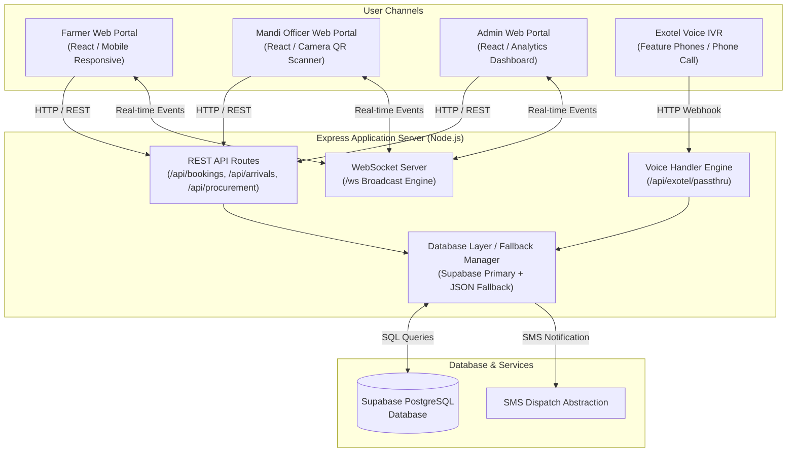

# KrishiDwaar — Smart Farmer Procurement Management System

> **A unified, real-time, multi-portal & Voice IVR agricultural procurement platform built for Smart India Hackathon 2026 (SIH26032).**

---

## 📌 SIH Problem Statement

- **Problem Statement ID**: `SIH26032`
- **Domain**: Farmer Procurement & Agricultural Mandi Management
- **The Challenge**: Traditional agricultural procurement yards (APMCs/Mandis) suffer from severe bottlenecking, lack of slot visibility, long farmer wait times, transparent weighing disputes, and fragmented data across regional markets.
- **The Solution**: **KrishiDwaar** delivers a unified digital ecosystem connecting Farmers, Mandi Officers, and State Administrators into a single real-time backend. By introducing structured time-slot booking, QR/Token gate verification, automated procurement billing, and an Exotel Voice IVR calling interface, KrishiDwaar eliminates mandi congestion and ensures transparent price realization.

---

## 📑 Project Overview

KrishiDwaar bridges the digital divide in Indian agriculture by providing two accessible channels: a responsive web application (for smartphones, tablets, and desktop computers) and an Exotel Voice IVR phone system (for feature phone users without internet access).

### Web App Architecture Flow
```
Farmer
  │
  ▼
Farmer Portal ──────► Shared Express Backend ──────► Supabase PostgreSQL Database
                             ▲                                    │
                             │                                    ▼
                     WebSocket Sync ─────────────► Mandi Officer Portal & Admin Portal
```

### Voice IVR Architecture Flow
```
Farmer Phone Call
  │
  ▼
Exotel IVR Webhook ──► Same Express Backend ──► Same Booking Engine ──► Supabase PostgreSQL ──► Real-Time Portals
```

All three web portals (**Farmer Portal**, **Mandi Officer Portal**, and **Admin Portal**) and the **Exotel Voice IVR system** operate on the **exact same Node.js/Express backend**, business logic, and **Supabase PostgreSQL database**. They are NOT independent applications with duplicate data stores.

---

## ✨ Key Features

### 🌾 1. Farmer Portal
- **Authentication**: 8-digit Farmer ID and password login/registration system.
- **Multi-Language Support**: Seamless instant switching between **English**, **Telugu (తెలుగు)**, and **Hindi (हिंदी)**.
- **Structured Slot Booking**:
  1. Select Crop (Paddy, Wheat, Pulses, Cotton, Maize, Groundnut) with live MSP rate display.
  2. Select Mandi (filtered automatically by mandis accepting the chosen crop).
  3. Select Date (30-day interactive availability calendar with Green/Yellow/Red capacity indicators).
  4. Select 30-Minute Time Slot (12 slots per day from 09:00 AM to 04:00 PM).
  5. Specify Expected Quantity in Quintals.
- **Booking Confirmation & Gate Pass**: Generates a unique Booking ID (`BK-XXXXXXXX`), Token Number (`TKN-XXXXXX`), and a scannable QR Code containing booking metadata.
- **Farmer Live Queue Tracker**: Live queue position tracking ("Verification Pending", "Waiting in Queue", "Procurement In Progress").
- **Bills & Transaction History**: View itemized procurement receipts, actual weighed quantity, MSP rates, calculated payouts, and unique payment reference numbers.
- **Notifications & Complaints**: Real-time notification inbox and dispute/complaint submission system with status tracking.

### 🏢 2. Mandi Officer Portal
- **Mandi Login**: Mandi ID selection (e.g. `MANDI01` — Warangal Agriculture Market) with secure authentication.
- **Mandi Operational Dashboard**: Real-time tracking of Today's Slots, Verified Arrivals, Pending Arrivals, and Completed Procurements.
- **Real Camera QR Gate Verification**: Uses the device camera via `html5-qrcode` to scan farmer booking QR codes directly at the market gate, decoding payloads and verifying booking eligibility in real time.
- **Token Verification Fallback**: Manual token number lookup tab (`TKN-XXXXXX`) when camera scanning is unavailable.
- **Daily Queue Management**: Live list of scheduled farmers categorized by status (`Pending`, `Arrived`, `In Progress`, `Completed`, `No-Show`).
- **Procurement & Billing Workflow**:
  - Start procurement for arrived farmers.
  - Record actual weighed quantity in quintals.
  - Auto-calculate total payout based on official MSP rate.
  - Generate digital payment receipts with payment reference IDs.
- **End-of-Day (EOD) Operational Reports**: Automated EOD summary generation and submission to the Admin Portal.
- **Complaint Resolution**: Mandi officer review and response interface for farmer grievances.

### 🛡️ 3. Admin Portal
- **Executive State Overview**: Real-time operational monitoring across all connected mandis in the state.
- **State-Wide KPI Metrics**: Total Mandis, Total Registered Farmers, Today's Bookings, Verified Gate Arrivals, Pending Arrivals, Completed Procurements, Total Quantity Procured (Qtl), and Total Payment Processed (₹).
- **Mandi Analysis & Performance**: Detailed turnout percentages, capacity utilization, average processing time per farmer, and active mandi status indicators.
- **Farmer Analysis**: Registration trends, regional distribution, active vs inactive farmer activity.
- **Daily Reports Oversight**: Centralized repository of submitted End-of-Day reports from mandi officers.
- **State Grievance Management**: Oversight of complaints across all mandis with filtering by status (`Submitted`, `Under Review`, `Resolved`, `Rejected`).

---

## 📞 Voice IVR Integration (Exotel)

For farmers without smartphones or internet access, KrishiDwaar features a complete voice IVR calling flow integrated via **Exotel**:

```
Farmer calls Exotel Number
  │
  ├─► 1. Enter 8-digit Farmer ID (DTMF) ──► Verified against Supabase
  ├─► 2. Select Crop (Press 1 for Paddy, 2 for Wheat, etc.)
  ├─► 3. Select Mandi (Dynamic audio list of accepting mandis)
  ├─► 4. Enter Date (4-digit MMDD, e.g. 2709 for Sept 27)
  ├─► 5. Select Time Slot (Press 0300# for 3:00 PM)
  ├─► 6. Enter Expected Quantity (e.g. 60*)
  └─► 7. Press 1 to Confirm ──► Booking Created with Source `VOICE_IVR`
```

- Reuses the **exact same backend database methods**, slot capacity constraints, and duplicate booking prevention rules as the Web Portal.
- Bookings created via Voice IVR automatically display source `VOICE_IVR` across the Mandi Officer and Admin portals in real time.
- Triggers SMS dispatch abstraction to the caller's mobile number containing Booking ID, Token Number, Mandi Name, Date, and Time Slot.

---

## 🏗️ System Architecture



---

## 🛠️ Technology Stack

| Layer | Technology | Purpose |
| :--- | :--- | :--- |
| **Frontend Framework** | React 18 + Vite 5 | SPA architecture, fast HMR, component modularity |
| **Styling & Design System** | Vanilla CSS + Design Tokens | Custom Agricultural Green color palette, glassmorphism, responsive grid |
| **Icons & Media** | Lucide React | Modern SVG icons across all portals |
| **QR Code Engine** | `qrcode` & `html5-qrcode` | QR generation for gate passes & camera QR scanning for mandi gate verification |
| **Backend Runtime** | Node.js + Express 4 | Server-side REST API, IVR routing engine, business validation |
| **Database** | Supabase (PostgreSQL) | Primary relational cloud database with indexes, enums, & foreign keys |
| **Real-Time Layer** | WebSockets (`ws`) | Instant cross-portal event broadcasting (`BOOKING_CREATED`, `FARMER_VERIFIED`, etc.) |
| **Voice / Telephony** | Exotel IVR Passthrough API | Interactive Voice Response telephone booking flow for feature phone users |
| **SMS Gateway** | Twilio SDK / SMS Abstraction | Formatted SMS confirmation dispatch for booking details |
| **Build & Tooling** | Vite, PostCSS, Concurrently | Production bundling and concurrent dev server execution |

---

## 🗄️ Database Schema (Supabase PostgreSQL)

The backend interacts with **9 primary database tables** in Supabase PostgreSQL:

```
           ┌──────────┐            ┌─────────┐
           │  crops   │            │ mandis  │
           └────┬─────┘            └───┬─────┘
                │                      │
                └──────────┬───────────┘
                           ▼
             ┌───────────────────────────┐
             │   mandi_accepted_crops    │
             └───────────────────────────┘

 ┌──────────┐        ┌──────────┐        ┌──────────────┐
 │ farmers  ├───────►│ bookings ├───────►│ procurements │
 └────┬─────┘        └────┬─────┘        └──────────────┘
      │                   │
      ▼                   ▼
┌──────────────┐    ┌────────────┐       ┌───────────────┐
│notifications │    │ complaints │       │ daily_reports │
└──────────────┘    └────────────┘       └───────────────┘
```

1. **`crops`**: Crop master catalog (Crop ID, Name, MSP Rate per Quintal, Icon).
2. **`mandis`**: Mandi master directory (Mandi ID, Name, Location, Password).
3. **`mandi_accepted_crops`**: Junction table mapping which crops each mandi accepts.
4. **`farmers`**: Registered farmer accounts (8-digit Farmer ID, Name, Mobile, Password, Language, Location, Bank Details).
5. **`bookings`**: Central slot reservations table (Booking ID, Token Number, QR Payload JSON, Farmer ID, Mandi ID, Crop ID, Date, Time Slot, Expected Qty, Arrival Status, Procurement Status, Stage, Source `WEB`/`VOICE_IVR`).
6. **`procurements`**: Completed procurement bills and financial transactions (Bill ID, Booking ID, Token, Actual Qty, MSP Rate, Total Amount, Billed By Officer, Payment Reference ID, Timestamp).
7. **`daily_reports`**: End-of-Day mandi operational reports (Mandi ID, Date, Total Booked, Verified, Completed, Procured Qty, Total Payout).
8. **`notifications`**: Farmer notification inbox messages (Notification ID, Farmer ID, Booking ID, Type, Title, Message, Read Flag).
9. **`complaints`**: Farmer grievance records (Complaint ID, Booking ID, Farmer ID, Mandi ID, Category, Description, Status `Submitted`/`Under Review`/`Resolved`/`Rejected`, Response Comment, Status History JSON).

---

## 🔄 Complete Booking & Procurement Lifecycle

```
[1. Select Crop] ──► [2. Select Mandi] ──► [3. Select Date] ──► [4. Select Time Slot] ──► [5. Enter Qty]
                                                                                               │
                                                                                               ▼
                                                                                     [6. Confirm Booking]
                                                                                               │
                                                                                               ▼
                                                                                   [7. Token & QR Pass Issued]
                                                                                               │
                                                                                               ▼
                                                                                   [8. Farmer Arrives at Gate]
                                                                                               │
                                                                                               ▼
                                                                                   [9. Camera QR / Token Scan]
                                                                                               │
                                                                                               ▼
                                                                                   [10. Arrival Verified]
                                                                                               │
                                                                                               ▼
                                                                                   [11. Weighing & Quality]
                                                                                               │
                                                                                               ▼
                                                                                   [12. Payout Bill Generated]
                                                                                               │
                                                                                               ▼
                                                                                   [13. Receipt & Admin Stats]
```

---

## 📷 Camera QR Verification

The Mandi Officer Portal features a real browser-based camera scanner in the **Verify Farmer** modal:

- **Browser Camera Access**: Requests browser camera permissions and launches the rear environment camera (`facingMode: "environment"`).
- **Instant Decoding**: Scans the farmer's booking QR code image, decodes the payload, and sends it directly to `POST /api/arrivals/verify`.
- **Server Validation**: The backend validates that the booking exists, belongs to the current Mandi, is scheduled for today, and has not already been verified.
- **Duplicate Prevention**: Prevents double-scanning or re-verifying already arrived bookings.
- **Token Fallback**: Provides a clean `[ Token Verification ]` tab (`TKN-XXXXXX`) for manual entry if camera access is unavailable.

---

## 🌐 Multi-Language Support (i18n)

The Farmer Portal provides built-in internationalization supporting three languages:

- **English (EN)**
- **Telugu / తెలుగు (TE)**
- **Hindi / हिंदी (HI)**

UI translation strings covering slot booking, profile settings, history, notifications, and queue statuses are managed dynamically via [`src/context/AppContext.jsx`](file:///c:/Users/uday0/OneDrive/Desktop/KARTHIK/MY%20NEW%20SIH%20PROJECT/src/context/AppContext.jsx).

---

## ⚡ Real-Time WebSocket Synchronization

KrishiDwaar includes an Express WebSocket server running on `/ws`:

- **Event Broadcasting**: Broadcasts live operational events across connected clients:
  - `BOOKING_CREATED`: Updates Mandi & Admin dashboards instantly when a web or voice booking is placed.
  - `FARMER_VERIFIED`: Updates active queue displays when a farmer passes gate verification.
  - `PROCUREMENT_COMPLETED`: Updates daily volume, payouts, and completed stats in real time.
- **Dynamic Connection**: Clients automatically construct WebSocket URLs supporting local development (`ws://localhost:5000/ws`) and production cloud hosts (`wss://<domain>/ws`).

---

## 🔒 Security Practices

- **Environment Secrets**: Sensitive keys (`SUPABASE_SERVICE_ROLE_KEY`, `EXOTEL_API_KEY`, etc.) are loaded strictly on the backend and excluded from Git via `.gitignore`.
- **Backend Service-Role Isolation**: The Supabase service-role key is never exposed to frontend code or client bundles.
- **CORS Protection**: Dynamic `cors()` middleware in `server/index.js` restricts cross-origin access to configured production frontend domains.
- **Fail-Safe Startup Guard**: The server validates required environment variables on launch and exits gracefully with diagnostic warnings if database credentials are missing.
- **Concurrency & Race Condition Safety**: Server-side transactional validation prevents slot double-booking or duplicate arrival verification even under simultaneous concurrent requests.

---

## 🧪 Automated Testing & Verification Results

The project contains a comprehensive automated test suite verifying all system layers:

```text
====================================================
📊 KRISHIDWAAR AUTOMATED VERIFICATION SUITE RESULTS
====================================================

✅ Phase 1: Supabase Primary Read Path Suite       10 / 10 PASSED
✅ Phase 2: Supabase Concurrency & Mutation Suite  10 / 10 PASSED
✅ Phase 3: Supabase Derived Read Path Suite        8 /  8 PASSED
✅ Exotel Voice IVR Simulation Suite               46 / 46 PASSED
✅ End-to-End Cross-Portal Integration Suite       21 / 21 PASSED

====================================================
🎉 TOTAL AUTOMATED VERIFICATION:                  107 / 107 PASSED
====================================================
```

---

## 💻 Local Development Setup

### 1. Prerequisites
- **Node.js**: v18.0.0 or higher
- **npm**: v9.0.0 or higher

### 2. Installation
```bash
# Clone the repository
git clone https://github.com/SJ-JAYAKARTHIK/Sih_project.git
cd Sih_project

# Install dependencies
npm install
```

### 3. Environment Configuration
Create a `.env.local` or `.env` file in the root directory:

```env
PORT=5000
SUPABASE_URL=https://your-supabase-project-id.supabase.co
SUPABASE_SERVICE_ROLE_KEY=your_supabase_service_role_key
FRONTEND_URL=http://localhost:5173
EXOTEL_ACCOUNT_SID=your_exotel_sid
EXOTEL_API_KEY=your_exotel_api_key
EXOTEL_API_TOKEN=your_exotel_api_token
EXOTEL_SUBDOMAIN=api.exotel.com
```

### 4. Running Locally
```bash
# Start both Backend API (Port 5000) and Frontend UI (Port 5173) concurrently
npm run dev

# Or start Backend API server only
npm run server

# Or start Frontend Vite development server only
npm run client
```

### 5. Production Build
```bash
# Build production bundle
npm run build

# Start production server
npm start
```

---

## 🔑 Environment Variables Reference

| Variable | Description | Required | Exposed to Frontend |
| :--- | :--- | :---: | :---: |
| `PORT` | Backend HTTP server port (default: 5000) | No | No |
| `SUPABASE_URL` | Supabase PostgreSQL API Endpoint URL | **Yes** | No |
| `SUPABASE_SERVICE_ROLE_KEY` | Server-side Supabase Service Role Key | **Yes** | **NO** |
| `FRONTEND_URL` | Allowed origin for production CORS configuration | No | No |
| `EXOTEL_ACCOUNT_SID` | Exotel telephony account SID | Optional | No |
| `EXOTEL_API_KEY` | Exotel API Key | Optional | No |
| `EXOTEL_API_TOKEN` | Exotel API Token | Optional | No |

---

## 🚀 Cloud Deployment Architecture

```text
Vercel
  ↓
Frontend

Railway
  ↓
Express Backend

Supabase
  ↓
PostgreSQL Database

Exotel
  ↓
Voice IVR → Railway Backend
```

- **Frontend**: Designed for single-command static deployment on **Vercel** (`npm run build`).
- **Backend**: Prepared for production cloud execution on **Railway** (`npm start`).
- **Database**: Cloud-hosted **Supabase PostgreSQL** database.
- **Voice IVR**: **Exotel** webhook integration routed directly to the cloud-hosted **Railway** backend.

---

## 📁 Project Structure

```text
Sih_project/
├── .agents/                    # Subagent skill instructions & references
├── server/                     # Express Backend Application
│   ├── data/
│   │   └── store.json          # Local JSON fallback data store
│   ├── scripts/
│   │   ├── schema.sql          # Supabase PostgreSQL Database Schema
│   │   ├── migrate-store-to-supabase.js
│   │   ├── test-supabase-primary-reads.js
│   │   ├── test-supabase-concurrency.js
│   │   ├── test-supabase-derived-reads.js
│   │   └── test-end-to-end-integration.js
│   ├── db.js                   # Supabase Database Access Layer & Fallback Engine
│   ├── index.js                # Express HTTP API & WebSocket Server
│   ├── test-voice-ivr.js       # Exotel Voice IVR Test Suite (46 tests)
│   └── voiceHandler.js         # Exotel Voice IVR State Machine & Passthrough Router
├── src/                        # React Frontend Application
│   ├── assets/                 # Graphics, icons, and illustrations
│   ├── components/             # Common UI components (Navbar, LandingPage)
│   ├── context/
│   │   └── AppContext.jsx      # Global State, i18n Translations & Auth Context
│   ├── i18n/                   # Translation strings (EN, TE, HI)
│   ├── portals/
│   │   ├── AdminPortal/        # Admin Dashboard, Reports, & Analysis
│   │   ├── FarmerPortal/       # Slot Booking, Profile, Queue, Bills
│   │   └── MandiOfficerPortal/ # Queue, Camera QR Scanner, Procurement Modal
│   ├── App.jsx                 # Main Portal Layout & View Switcher
│   ├── index.css               # Global Design Tokens & Mobile Responsive CSS
│   └── main.jsx                # React DOM Entry Point
├── utils/                      # Supabase SSR client utilities
├── .gitignore
├── package.json
└── README.md
```

---

## 👤 User Roles & Responsibilities

| Role | Access Credentials | Primary Responsibilities |
| :--- | :--- | :--- |
| **Farmer** | 8-digit ID (e.g. `10029384`) + Password | Reserve procurement time slots, view QR gate pass, track queue status, view payout bills. |
| **Mandi Officer** | Mandi ID (e.g. `MANDI01`) + Password (`123456`) | Scan gate QR codes, verify arrival tokens, weigh crop, process procurement payout, submit EOD reports. |
| **Administrator** | Admin ID (`ADMIN01`) + Password (`admin123`) | Monitor state-wide procurement analytics, review mandi capacity, inspect EOD reports, resolve complaints. |

---

## 📊 Current Project Status

- **System Type**: Smart India Hackathon 2026 Prototype & Demonstration-Ready Platform (`SIH26032`).
- **Database Status**: Complete Supabase PostgreSQL schema with 9 tables, indexes, enums, and foreign keys.
- **Backend Status**: Production cloud-ready Express backend with environment guards, fail-safes, and 100% data access migration to Supabase.
- **Frontend Status**: Fully responsive single-page web app built with React & Vite, supporting camera QR scanning and multi-language translation.
- **Verification Status**: 107 / 107 automated tests passing.

---

## 🔮 Future Enhancements

- **Direct SMS Gateway Integration**: Connect live SMS provider (e.g., Exotel/Twilio) for production booking confirmation text messages.
- **Direct Banking / UPI Payment Gateway**: Integration with NPCI / e-RUPI / Bank APIs for automated instant farmer bank account payout transfers.
- **Govt. AgMarknet API Sync**: Real-time synchronization of daily mandi arrival volumes and prices with central AgMarknet portal.
- **Multilingual Voice Recognition (AI)**: Natural language speech-to-text input for Voice IVR in regional dialects.

---

## 🏆 Credits & Acknowledgments

Developed for **Smart India Hackathon 2026 (SIH26032)** — *Farmer Procurement Management System*.
