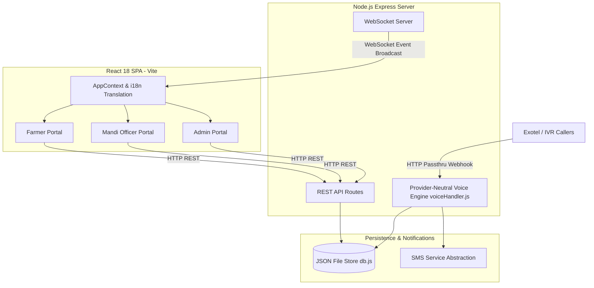

# System Architecture - KrishiDwaar

## Overview
KrishiDwaar utilizes a full-stack web and real-time architecture. The client is a React 18 Single Page Application (SPA) bundled via Vite. The backend is an Express Node.js application exposing REST APIs, managing an in-memory & JSON file store (`server/data/store.json`), running a provider-neutral IVR state machine (`server/voiceHandler.js`), and operating a WebSocket server for real-time state synchronization.

---

## Architectural Components

---

## Component Details

### 1. Frontend Architecture
- **State Management**: `AppContext.jsx` manages user credentials, active portal views, multi-language translation state (`language`), and WebSocket connection lifecycle.
- **View Layer**: Modular functional React components under `src/portals/` (`FarmerPortal/`, `MandiOfficerPortal/`, `AdminPortal/`).
- **Asset Pipeline**: Static graphics reside under `public/assets/` and are built into `dist/assets/` during `npm run build`.

### 2. Backend Architecture
- **Express Server**: `server/index.js` handles API routing, authentication, slot calculation, and procurement processing.
- **Voice / IVR Engine**: `server/voiceHandler.js` maintains active call sessions in `exotelSessions = new Map()` with a 20-minute inactivity timeout. Implements 12-stage provider-neutral state machine, 8-digit Farmer ID verification, dynamic crop-to-mandi filtering, DDMM date parsing, `HHMM*`/`HHMM#` time slot parsing, quantity entry, and pre-booking revalidation.
- **WebSocket Synchronization**: The backend maintains a `ws` WebSocket server. When a booking, gate verification, or queue change occurs, `broadcast()` sends real-time JSON events (`VOICE_BOOKING_CREATED`, `BOOKING_CREATED`, `FARMER_VERIFIED`) to all connected clients.

### 3. Data Storage & Persistence
- **JSON File Store**: `server/db.js` acts as an in-memory database synced synchronously to `server/data/store.json`. Reused seamlessly by both Web UI and IVR voice systems.

### 4. Phone IVR Integration
- **Webhooks**: Exotel (`/api/voice/exotel`) and test endpoints (`/api/voice/exotel/test`) handle DTMF keypad selections for non-smartphone farmers with full session state retention across requests.
