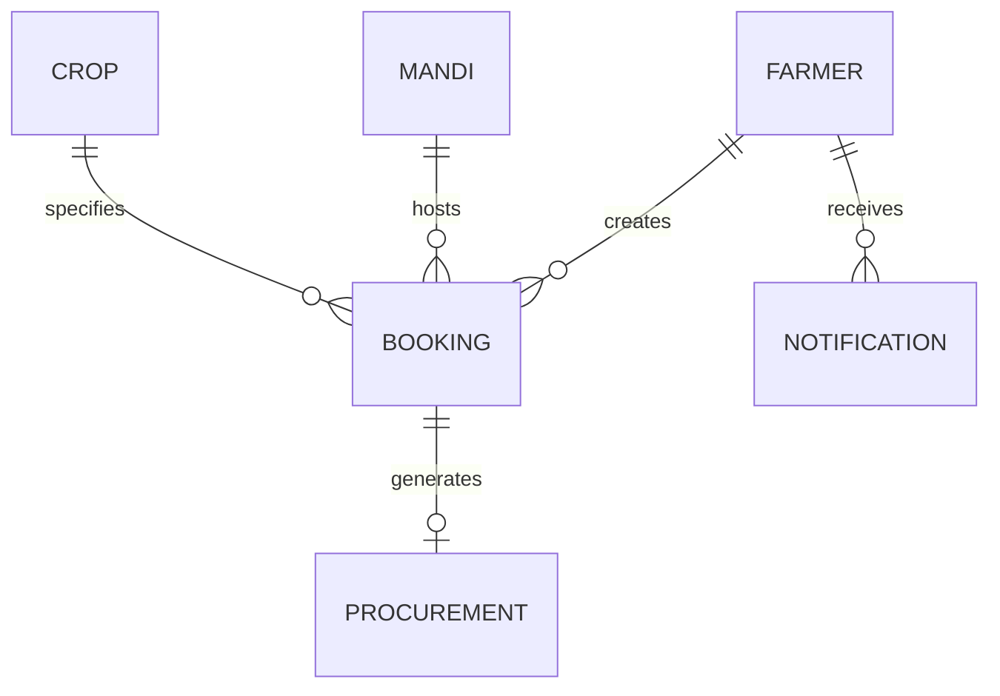

# Database Architecture & Data Schemas - KrishiDwaar

*The system uses an in-memory JSON database (`server/db.js`) synchronized synchronously to `server/data/store.json`.*

---

## Entity Relationship Model

---

## Data Collections

### 1. `farmers`
| Field | Type | Description |
|---|---|---|
| `id` | String | 8-digit unique Farmer ID (e.g., "10000001") |
| `name` | String | Farmer's full name |
| `mobile` | String | 10-digit mobile number |
| `password` | String | Password |
| `language` | String | Preferred language ("EN", "HI", "TE") |
| `location` | String | Village / District location |
| `bankDetails` | String | Masked bank account reference |

### 2. `mandis`
| Field | Type | Description |
|---|---|---|
| `id` | String | Mandi identifier (e.g., "MANDI01") |
| `name` | String | Mandi display name |
| `location` | String | District / State location |
| `acceptedCrops` | Array<String> | Supported crop IDs |
| `password` | String | Mandi officer login password |

### 3. `crops`
| Field | Type | Description |
|---|---|---|
| `id` | String | Crop identifier (e.g., "crop-1") |
| `name` | String | Crop name (Paddy, Wheat, etc.) |
| `ratePerQuintal` | Number | Government Minimum Support Price (MSP) |
| `icon` | String | Display icon / asset path |

### 4. `bookings`
| Field | Type | Description |
|---|---|---|
| `id` | String | Unique booking reference ID |
| `tokenNumber` | String | Gate pass token (e.g., "TKN-123456") |
| `farmerId` | String | References `farmers.id` |
| `mandiId` | String | References `mandis.id` |
| `cropId` | String | References `crops.id` |
| `date` | String | Reservation date (YYYY-MM-DD) |
| `timeSlot` | String | 30-min window (e.g., "09:00 - 09:30") |
| `expectedQty` | Number | Estimated quantity (Quintals) |
| `actualQty` | Number | Weighed quantity at Mandi |
| `arrivalStatus` | String | "Pending" or "Verified / Arrived" |
| `procurementStage` | String | "NOT_ARRIVED", "WAITING", "IN_PROGRESS", "COMPLETED" |
| `bookingStatus` | String | "ACTIVE", "CANCELLED", "NO_SHOW" |

### 5. `procurements`
| Field | Type | Description |
|---|---|---|
| `id` | String | Unique bill receipt ID |
| `bookingId` | String | References `bookings.id` |
| `actualQty` | Number | Final weighed quantity |
| `ratePerQuintal` | Number | MSP rate applied |
| `totalAmount` | Number | `actualQty * ratePerQuintal` |
| `billedBy` | String | Mandi officer ID |
| `paymentRef` | String | Generated payment transaction reference |
