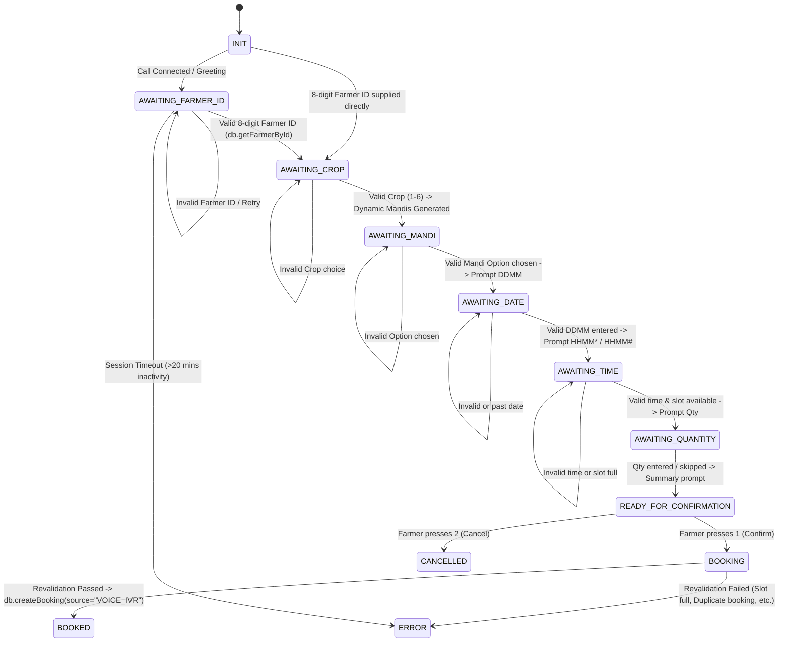

# Interactive Voice Response (IVR) Subsystem — KrishiDwaar

## Overview
The KrishiDwaar IVR subsystem provides a **provider-neutral inbound voice booking engine** allowing farmers to complete mandi procurement bookings via feature phones or landlines using standard DTMF keypad inputs.

---

## 12-Stage Voice State Machine

---

## Webhook Architecture & Endpoints

### 1. `GET /api/voice/exotel` & `POST /api/voice/exotel`
- **Purpose**: Primary webhook endpoint for Exotel Passthru integration.
- **Parameters**: `CallSid` / `CallFrom`, `digits` (DTMF inputs, automatically handles quoted strings like `'"10029384"'`).
- **Session Management**: Session Map (`exotelSessions`) in `server/voiceHandler.js` keyed by `CallSid` with an automated 20-minute inactivity cleanup (`SESSION_TIMEOUT_MS`).

### 2. `POST /api/voice/exotel/test`
- **Purpose**: Integration test endpoint executing identical state-machine logic without placing actual telephone calls.

---

## Centralized Crop Mappings (Keys 1 to 6)

| Keypad Digit | Crop ID | Crop Name | Dynamic Mandi Options Generated |
| :---: | :--- | :--- | :--- |
| `1` | `crop-1` | Paddy | Warangal Agriculture Market, Nizamabad APMC Mandi, Khammam Procurement Yard |
| `2` | `crop-2` | Wheat | Warangal Agriculture Market, Nizamabad APMC Mandi, Khammam Procurement Yard |
| `3` | `crop-3` | Cotton | Warangal Agriculture Market, Guntur Grain Yard, Khammam Procurement Yard |
| `4` | `crop-4` | Maize | Warangal Agriculture Market, Nizamabad APMC Mandi, Khammam Procurement Yard |
| `5` | `crop-5` | Pulses | Warangal Agriculture Market, Nizamabad APMC Mandi, Guntur Grain Yard |
| `6` | `crop-6` | Gram | Nizamabad APMC Mandi, Guntur Grain Yard, Khammam Procurement Yard |

---

## Input Formats & Validation Rules

- **Farmer ID**: Exactly 8 numeric digits (`/^\d{8}$/`). Validated against `db.getFarmerById()`.
- **Mandi Choice**: Option number (`1`, `2`, `3`) corresponding to the dynamically generated Mandi list for the selected crop.
- **Date (`DDMM`)**: 4 numeric digits (`/^\d{4}$/`). Converted to `YYYY-MM-DD`. Rejects invalid calendar dates and past dates.
- **Time (`HHMM*` / `HHMM#`)**: 4 digits + `*` (AM) or `#` (PM). Converted to 24-hour time and mapped to 30-minute slots (`HH:MM - HH:MM`). Checks slot availability in `db.getTimeSlots()`.
- **Expected Quantity**: 1 to 3 numeric digits (0–999 kg) or `*` to skip.
- **Confirmation**: `1` to confirm booking, `2` to cancel.

---

## Post-Booking Integrations

1. **Database Persistence**: Booking saved via `db.createBooking({ ..., source: "VOICE_IVR" })`, generating unique Token Numbers (`TKN-XXXXXX`) and QR payloads.
2. **Portal Visibility**: Instantly visible in Farmer Portal (`GET /api/bookings/farmer/:farmerId`) and Mandi Officer Portal queue (`GET /api/bookings/mandi/:mandiId`).
3. **Real-time WebSockets**: Emits `VOICE_BOOKING_CREATED` and `BOOKING_CREATED` events to all open portal screens.
4. **SMS Abstraction**: `sendBookingSms()` dispatches confirmation SMS to the farmer's registered mobile number (`farmer.mobile`).

---

## Automated Verification Suite
- Test script: `server/test-voice-ivr.js`
- **Result**: 18 / 18 tests passed (Happy path lifecycle, invalid Farmer ID, invalid crop, invalid Mandi option, past date, invalid time, cancellation, duplicate booking check, and session expiration).
