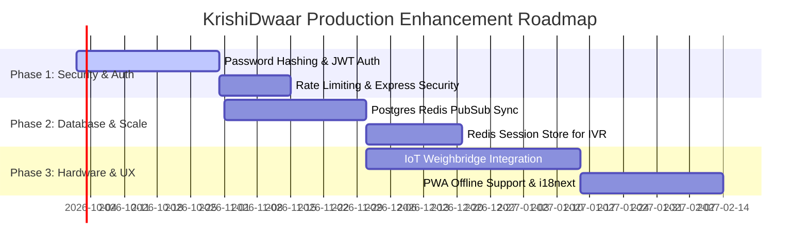

# Limitations & Drawbacks — KrishiDwaar System

> **Document Version**: 1.0.0  
> **Last Updated**: September 2026  
> **Scope**: System Architecture, Security, Database, Voice IVR, Frontend UX, Hardware Integration, & Infrastructure Limitations of KrishiDwaar (SIH26032)

---

## 📌 Executive Summary

**KrishiDwaar** (*Smart Farmer Procurement Management System*) effectively solves key bottlenecking and slot management problems in agricultural Mandis by providing a multi-portal web platform and a Voice IVR calling interface. However, like many prototype and hackathon systems, the current implementation contains technical, operational, security, and architectural limitations that must be addressed prior to full-scale enterprise or government deployment across state-wide procurement centers.

This document details the current **limitations, drawbacks, and technical debt** across seven critical domain areas, followed by a recommended strategic roadmap for production readiness.

---

## 1. 🔒 Security & Authentication Limitations

| Issue / Gap | Current Code Location | Impact & Vulnerability |
| :--- | :--- | :--- |
| **Plaintext Password Storage** | [`server/db.js`](file:///c:/Users/uday0/OneDrive/Desktop/KARTHIK/MY%20NEW%20SIH%20PROJECT/server/db.js#L32) | Farmer and Mandi Officer passwords (`password123`, `123456`) are stored and checked in plain text without cryptographic hashing (e.g., `bcrypt`, `argon2`, or `scrypt`). A database compromise exposes all user credentials. |
| **Lack of Stateless Auth (JWT/Sessions)** | [`server/index.js`](file:///c:/Users/uday0/OneDrive/Desktop/KARTHIK/MY%20NEW%20SIH%20PROJECT/server/index.js#L86-L100) | Login endpoints return user objects directly without issuing cryptographically signed tokens (JWT or HTTP-only session cookies). Subsequent API calls rely on client-supplied IDs without auth verification headers. |
| **Hardcoded Credential Fallbacks** | [`server/db.js`](file:///c:/Users/uday0/OneDrive/Desktop/KARTHIK/MY%20NEW%20SIH%20PROJECT/server/db.js#L17) | Default Supabase publishable keys are hardcoded as code fallbacks in source files, risking exposure if environment variables are unconfigured. |
| **Missing API Rate Limiting** | [`server/index.js`](file:///c:/Users/uday0/OneDrive/Desktop/KARTHIK/MY%20NEW%20SIH%20PROJECT/server/index.js) | No rate-limiting middleware (`express-rate-limit`) is applied to authentication, booking, or IVR webhook endpoints, making the backend susceptible to credential brute-forcing and Denial-of-Service (DoS) attacks. |
| **Lack of Backend RBAC Middleware** | [`server/index.js`](file:///c:/Users/uday0/OneDrive/Desktop/KARTHIK/MY%20NEW%20SIH%20PROJECT/server/index.js) | Role-based authorization is enforced primarily at the UI portal level. API routes do not inspect caller tokens or restrict officer endpoints (e.g. `/api/procurement/complete`) via server-side role validation. |

---

## 2. 🗄️ Database & Data Architecture Limitations

```
Current Hybrid Dual-Storage Pattern:
┌─────────────────────────┐      ┌──────────────────────────────┐
│ In-Memory & File Store  │ ◄──► │ Supabase Cloud PostgreSQL    │
│  (server/data/store.json)│      │ (Bypasses RLS via Service Role)│
└─────────────────────────┘      └──────────────────────────────┘
```

1. **Dual-Storage Synchronization Fragility**:
   - The application supports both an in-memory/JSON store ([`server/data/store.json`](file:///c:/Users/uday0/OneDrive/Desktop/KARTHIK/MY%20NEW%20SIH%20PROJECT/server/data/store.json)) and Supabase PostgreSQL.
   - When running in file-backed mode, synchronous `fs.writeFileSync` operations block the Node.js single-threaded event loop under heavy concurrent load.

2. **Inability to Scale Horizontally with File Store**:
   - The JSON database cannot scale across multiple application server instances (e.g., container clusters or serverless instances), as each instance maintains its own local memory state and file copy.

3. **Database Row Level Security (RLS) Bypass**:
   - Backend queries interact with Supabase using `SUPABASE_SERVICE_ROLE_KEY` in `db.js`. While this simplifies server-side queries, it bypasses Postgres Row Level Security (RLS) policies, requiring all data scoping and isolation logic to be hand-written in JavaScript application code.

4. **Lack of Automated Database Migrations**:
   - Schema modifications are executed via manual SQL scripts rather than a managed migration framework (e.g., Prisma Migrations, Knex, or Supabase CLI migration workflows).

---

## 3. 📞 Voice IVR (Exotel Subsystem) Limitations

1. **In-Memory Call Session Storage**:
   - Active phone call states are stored in Node.js process memory using `exotelSessions = new Map()`.
   - If the backend server restarts, crashes, or scales across load-balanced nodes during an active call, the farmer's session state is lost, resulting in dropped or failed IVR bookings.

2. **Rigid DTMF Input Menu (No AI Voice / Natural Language)**:
   - The IVR requires farmers to navigate multi-step numeric DTMF keypad menus (e.g., pressing `0300#` for 3:00 PM or entering 8-digit IDs).
   - Elderly or low-literacy farmers may struggle with DTMF timing and precise keypress combinations. There is no Natural Language Processing (NLP) or Indic Conversational AI voice bot (Speech-to-Text / Text-to-Speech in native dialects).

3. **No Automated Retry Queue for SMS Dispatch**:
   - Booking confirmation SMS dispatch relies on simple API calls without an asynchronous background message queue (e.g., BullMQ with Redis). If carrier gateways fail, SMS notifications are lost without retries.

---

## 4. 🌐 Frontend, UX & Connectivity Limitations

```
Current Navigation Architecture:
Client Browser ──► AppContext (Portal State) ──► Renders Component (No Route URL Change)
```

1. **State-Based Navigation (No URL Routing)**:
   - Portal switching is managed via React Context (`activePortal` state in [`src/context/AppContext.jsx`](file:///c:/Users/uday0/OneDrive/Desktop/KARTHIK/MY%20NEW%20SIH%20PROJECT/src/context/AppContext.jsx)) without client-side routing libraries like `react-router-dom` or framework routing.
   - Users cannot bookmark specific portal pages, share direct links, or use browser Back/Forward navigation buttons without resetting UI state.

2. **Lack of Offline / PWA Capability**:
   - The application lacks Progressive Web App (PWA) configuration (Service Worker, Web App Manifest, offline storage with IndexedDB).
   - Farmers in remote rural areas with poor 2G/3G connectivity cannot view saved QR gate passes, check booking tokens, or access previous procurement receipts while offline.

3. **Hardcoded Multi-Language Translations**:
   - UI internationalization relies on static dictionary maps in `AppContext.jsx` for English, Telugu, and Hindi.
   - Adding new regional languages (such as Marathi, Kannada, Tamil, or Odia) requires manual code changes and rebuilds rather than dynamic i18n JSON translation files (e.g., `i18next`).

4. **Camera-Based QR Verification Constraints**:
   - Mandi gate verification relies on browser camera scanning via `html5-qrcode`.
   - In outdoor Mandi environments with low lighting, severe dust, direct glare, or low-cost smartphone cameras, QR scanning can fail, forcing Mandi staff to rely entirely on manual token entry fallback.

5. **Accessibility (a11y) Gaps**:
   - Missing full ARIA accessibility labels (`aria-label`, `role`), screen reader flow optimization, and high-contrast color modes for visually impaired users or non-literate navigation.

---

## 5. ⚖️ Procurement & Hardware Integration Limitations

1. **Manual Weighed Quantity Entry**:
   - Mandi Officers manually type the weighed grain quantity (quintals) into an input field during procurement billing.
   - This creates potential for human entry error or manual tampering. The system lacks direct hardware connectivity (via serial port / IoT gateway) to physical Mandi digital weighbridges.

2. **Simulated Payment Gateway & Reference IDs**:
   - Payment receipts generate simulated reference codes (`PAY-XXXXXX`), but do not integrate directly with real-world banking infrastructure (e.g., Direct Benefit Transfer (DBT), Public Financial Management System (PFMS), NPCI AePS, or UPI payout gateways).

3. **Static Slot Capacity Allocation**:
   - Slot availability limits are fixed per 30-minute window regardless of transport vehicle type (e.g., a tractor carrying 100 quintals occupies the same slot allocation as a bullock cart carrying 10 quintals).
   - Dynamic capacity calculation based on total volume capacity or crop quality inspection time is not currently implemented.

---

## 6. 🚀 Infrastructure, Scaling & Real-Time Limitations

1. **Single-Node WebSocket Server (`ws`)**:
   - The WebSocket broadcast server ([`server/index.js`](file:///c:/Users/uday0/OneDrive/Desktop/KARTHIK/MY%20NEW%20SIH%20PROJECT/server/index.js#L68-L77)) operates on a single Node.js instance.
   - When deploying to multi-server environments behind a load balancer, WebSocket events broadcasted on Server A will not reach client connections connected to Server B without a Redis Pub/Sub adapter.

2. **Deployment Friction on Serverless Platforms**:
   - Deploying the backend monolith to serverless environments (such as Vercel Serverless Functions) causes issues with long-lived WebSocket connections (`wss://`) and in-memory Map sessions. A persistent container server (e.g., AWS EC2, Render, Docker/K8s) is required for real-time WebSocket functionality.

3. **Basic Unstructured Logging**:
   - Server logs rely on standard `console.log()` statements without structured JSON logging frameworks (e.g., `pino` or `winston`) or centralized Application Performance Monitoring (APM) tools (e.g., Sentry, Datadog, or Grafana).

---

## 7. 🧪 Testing & Quality Assurance Limitations

1. **Missing End-to-End (E2E) UI Automation**:
   - While automated backend API and integration test scripts exist (e.g., `test-supabase-primary-reads.js`), the repository lacks browser E2E test suites (Cypress or Playwright) to test multi-portal user interactions, camera scanning, and visual regressions across screen sizes.

---

## 🎯 Recommended Strategic Enhancement Roadmap

To evolve KrishiDwaar from a functional SIH hackathon prototype to an enterprise-grade government production system, the following phased enhancements are recommended:



### Phase 1: Immediate Security & Authentication Hardening (Short-Term)
- 🔒 Implement `bcrypt` / `argon2` password hashing in [`server/db.js`](file:///c:/Users/uday0/OneDrive/Desktop/KARTHIK/MY%20NEW%20SIH%20PROJECT/server/db.js).
- 🔑 Introduce JWT tokens / HTTP-only cookies for authenticated REST API calls with backend role validation middleware.
- 🛡️ Add `express-rate-limit` and `helmet` middleware to protect HTTP and IVR routes.

### Phase 2: Scalability & Telephony Architecture (Mid-Term)
- 🔄 Migrate Exotel IVR call sessions (`exotelSessions`) from in-memory JavaScript `Map` to **Redis key-value store** with TTL expiry.
- 📡 Implement **Redis Pub/Sub adapter** for WebSocket server to enable seamless horizontal scaling across multiple container nodes.
- 🗣️ Integrate AI Voice Agent / Speech-to-Text (STT) models for regional Indic languages to allow natural voice booking over IVR calls.

### Phase 3: Hardware Integration & PWA Offline Experience (Long-Term)
- ⚖️ Build serial/WebSerial API & IoT Webhook integration for automatic scale weight reading from Mandi digital weighbridges.
- 📱 Convert the React web application into a **Progressive Web App (PWA)** with Service Worker caching for offline gate pass viewing.
- 💳 Integrate direct government payment gateway APIs (PFMS / DBT / UPI) for real-time fund disbursement confirmation.
