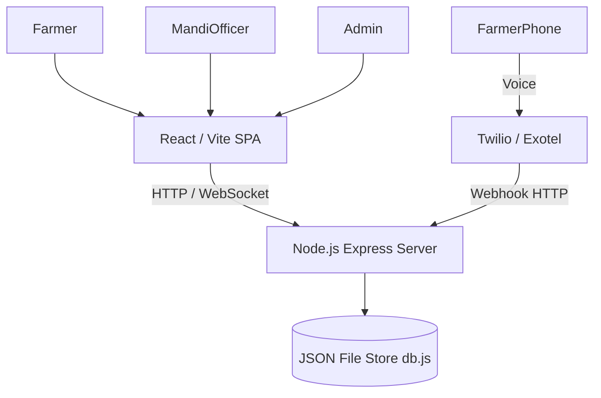

# SIH26032 – KrishiDwaar: Farmer Procurement and Mandi Management Platform

## Overview
**KrishiDwaar** is a web-based and IVR-assisted platform designed to streamline crop procurement for farmers, Mandi officers, and administrators. It enables farmers to register, view mandi availability, check real-time queue statuses, and book procurement slots via both a responsive web portal and a phone-based IVR system.

---

## Key Features & Portals

### 1. Farmer Portal
- **Registration & Auth**: 8-digit unique ID registration and login.
- **Slot Reservation**: 30-minute time slot booking with green/yellow/red mandi capacity indicators.
- **Live Queue Tracking**: Real-time position tracking, estimated wait time, and current token being served.
- **Multi-Language Support**: Instant switching between English, Hindi, and Telugu.
- **Digital Gate Pass**: Instant QR Code and token generation for gate verification.

### 2. Mandi Officer Portal
- **Arrival Verification**: Scan farmer QR code or enter token number to verify arrivals.
- **Queue Management**: Call farmers to weighing counters in real-time.
- **Instant Procurement Billing**: Record actual weighed quantities and generate digital receipts.
- **Daily Summaries**: View end-of-day procurement totals and statistics.

### 3. Admin Portal (KrishiDwaar Executive Dashboard)
- **State Overview Banner**: Visual state summary featuring crop graphics and key performance indicators.
- **2-Row Metric Grid**: Tracks Total Mandis, Registered Farmers, Active Bookings, Verified Arrivals, Pending, Completed, Quantity Procured, and Payment Status.
- **Dual Analytical Views**: Switch between system Overview and granular Mandi Analysis.
- **Commodity Performance**: View live mandi procurement tables with status pills and filtering controls.

---

## Technology Stack

- **Frontend**: React 18, Vite, React Router, Vanilla CSS, React Context API
- **Backend**: Node.js, Express, `ws` (WebSockets)
- **Database**: In-memory / JSON File Store (`server/data/store.json`)
- **Assets Pipeline**: `public/assets/` compiled into `dist/assets/` via Vite
- **Voice/IVR**: Twilio SDK, Exotel Webhooks

---

## System Architecture



---

## Project Structure

- `src/` - React frontend components, context, and portal views.
- `public/assets/` - Production static assets (`admin_portal_assets/`, `farmer_portal_assets/`, `mandi_officer_portal_assets/`).
- `dist/` - Production build directory generated via `npm run build` (contains `dist/assets/`).
- `server/` - Node.js Express backend and WebSocket server.
- `server/data/` - JSON database storage (`store.json`).
- `docs/` - Comprehensive project documentation.

---

## Installation & Setup

1. Install dependencies:
```bash
npm install
```

2. Run local development environment (Frontend + Backend concurrently):
```bash
npm run dev
```

3. Build production output (outputs static bundle and assets to `dist/`):
```bash
npm run build
```

---

## Documentation Index

- [summary.md](file:///c:/Users/uday0/OneDrive/Desktop/KARTHIK/MY%20NEW%20SIH%20PROJECT/docs/summary.md) - Executive summary of the platform.
- [phases.md](file:///c:/Users/uday0/OneDrive/Desktop/KARTHIK/MY%20NEW%20SIH%20PROJECT/docs/phases.md) - Software development phases and roadmap.
- [ARCHITECTURE.md](file:///c:/Users/uday0/OneDrive/Desktop/KARTHIK/MY%20NEW%20SIH%20PROJECT/docs/ARCHITECTURE.md) - Full technical architecture.
- [DESIGN.md](file:///c:/Users/uday0/OneDrive/Desktop/KARTHIK/MY%20NEW%20SIH%20PROJECT/docs/DESIGN.md) - UI design system and aesthetics.
- [API.md](file:///c:/Users/uday0/OneDrive/Desktop/KARTHIK/MY%20NEW%20SIH%20PROJECT/docs/API.md) - Complete REST API and Webhook reference.
- [DATABASE.md](file:///c:/Users/uday0/OneDrive/Desktop/KARTHIK/MY%20NEW%20SIH%20PROJECT/docs/DATABASE.md) - Entity relationship and table schemas.
- [CONTEXT.md](file:///c:/Users/uday0/OneDrive/Desktop/KARTHIK/MY%20NEW%20SIH%20PROJECT/docs/CONTEXT.md) - Business domain and user journeys.
- [IVR.md](file:///c:/Users/uday0/OneDrive/Desktop/KARTHIK/MY%20NEW%20SIH%20PROJECT/docs/IVR.md) - Phone IVR call flow specifications.
- [RULES.md](file:///c:/Users/uday0/OneDrive/Desktop/KARTHIK/MY%20NEW%20SIH%20PROJECT/docs/RULES.md) - Coding and contribution rules.
- [SECURITY.md](file:///c:/Users/uday0/OneDrive/Desktop/KARTHIK/MY%20NEW%20SIH%20PROJECT/docs/SECURITY.md) - Security guidelines and audit.
- [TECH.md](file:///c:/Users/uday0/OneDrive/Desktop/KARTHIK/MY%20NEW%20SIH%20PROJECT/docs/TECH.md) - Detailed technology reference.
- [technical_requirements.md](file:///c:/Users/uday0/OneDrive/Desktop/KARTHIK/MY%20NEW%20SIH%20PROJECT/docs/technical_requirements.md) - Future Supabase migration blueprint.
