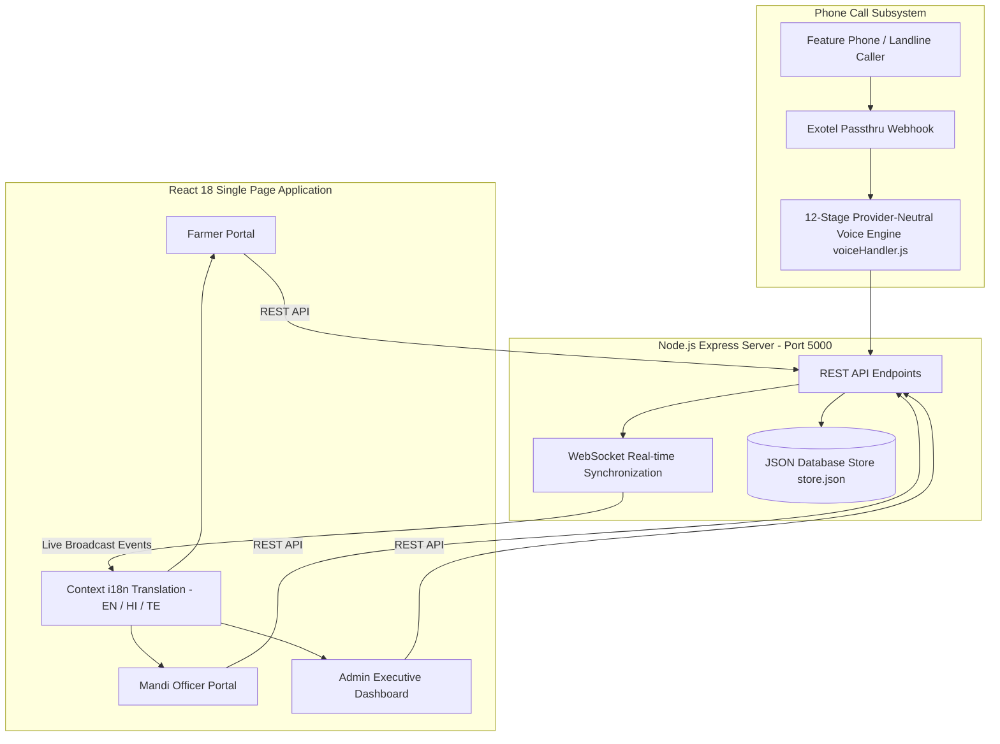

# Comprehensive System Overview — KrishiDwaar (SIH26032)

## Executive Overview

**KrishiDwaar** (*Smart Farmer Procurement Management System*) is an end-to-end, multi-portal digital agricultural logistics platform. Built for the Smart India Hackathon (SIH26032), KrishiDwaar bridges the operational gap between rural farmers, APMC Mandi officers, and government agricultural administrators.

- **Brand Slogan**: *"From Farm to Market, We Bridge the Gap"*
- **Brand Motto**: *"Empowering Farmers | Strengthening Markets | Building a Smarter Tomorrow"*
- **Primary Objective**: Eliminate overnight farmer queues at procurement centers, provide transparent 30-minute slot availability, issue instant digital QR gate passes, automate Minimum Support Price (MSP) bill calculations, and provide feature-phone voice access via Interactive Voice Response (IVR).

---

## Architecture & Ecosystem Map

---

## Detailed Portal & Subsystem Specification

### 1. Farmer Portal 🌾

Designed for ease of use across smartphones and tablets, with multi-language support and zero technical friction.

- **Authentication**:
  - Unique 8-digit Farmer ID authentication (e.g. `10029384`) with password persistence.
  - Registration generates auto-sequenced 8-digit IDs linked to land location, registered mobile, and bank details.
- **30-Minute Slot Allocation Engine**:
  - Color-coded availability indicators: **Green** (High Availability), **Yellow** (Limited Slots), **Red** (Fully Booked / Unavailable).
  - Maximum daily capacity cap (20 slots/day per Mandi) divided into 12 operating 30-minute time slots (09:00 to 16:00).
- **Live Queue Tracking System**:
  - Real-time status cards showing:
    - **Active Token Number** (e.g. `TKN-849201`)
    - **Queue Position** (e.g. `#1`)
    - **Farmers Ahead in Queue**
    - **Currently Serving Token at Mandi Counter**
    - **Estimated Wait Time** (dynamically computed based on historical weighing duration)
- **Digital QR Gate Pass**:
  - Instant client-side QR Code generation (`qrcode` library) encoding booking ID, token, farmer identity, mandi, date, and slot.
  - Printable and downloadable gate pass card for Mandi entry.
- **Rescheduling & Cancellation**:
  - One-click cancellation with instant slot capacity release.
  - Date and time slot rescheduling with strict overbooking validation.
- **Billing & History**:
  - Comprehensive history of active, completed, cancelled, and no-show procurement orders.
  - Instant digital bills showing weighed quantity, MSP rate per quintal, total bill amount, transaction ID, and payment status.

---

### 2. Mandi Officer Portal 🏢

A high-efficiency operational workspace tailored for Mandi staff at procurement centers.

- **Arrival Verification Workflow**:
  - Integrated QR scanner (`html5-qrcode`) and manual Token search (`TKN-XXXXXX`).
  - Verifies that the booking belongs to the current Mandi and today's date.
  - Transitions arrival status from `"Pending"` to `"Verified / Arrived"` and places farmer into the active queue.
- **Live Queue Management & Calling**:
  - One-click **Start Procurement** button calling the next waiting farmer to the weighing scale.
  - Broadcasts `PROCUREMENT_STARTED` event to update the farmer's live queue screen.
- **Instant MSP Billing & Procurement Completion**:
  - Form for recording actual weighed quantity in quintals/kg.
  - Auto-calculates total payment (`actualQty * ratePerQuintal`).
  - Issues digital procurement receipts with automated payment transaction IDs.
- **End-of-Day (EOD) Analytics & Excel Export**:
  - Daily procurement summaries categorized by commodity type.
  - Automated spreadsheet export (`xlsx` library) generating Excel reports for Mandi records.
- **Grievance Management**:
  - View and resolve farmer complaints regarding queue delays, quality inspection, or payment queries.

---

### 3. Admin Portal (KrishiDwaar Executive Dashboard) 📊

A centralized command center for agricultural authorities and state coordinators.

- **Brand Header & State Banner**:
  - Dark deep-green brand header with decorative wheat artwork and state procurement metrics.
- **2-Row Executive Metric Grid**:
  - **Row 1**: Total Registered Mandis, Total Farmers, Total Bookings, Verified Gate Arrivals.
  - **Row 2**: Pending Procurements, Completed Transactions, Total Commodity Quantity Procured (Quintals), Total Payments Released (₹).
- **Dual Analytical Views**:
  - **System Overview**: Macro analytics, state-wide commodity breakdown, procurement progress bars, and status distributions.
  - **Mandi Analysis**: Micro performance table listing every APMC Mandi, location, active volume, officer contact, and interactive search/filtering.
- **System Complaints Monitor**:
  - Real-time tracking of unresolved grievances across all state Mandis.

---

### 4. Provider-Neutral Inbound Voice / IVR Procurement Subsystem 📞

A phone-based procurement booking engine designed for non-smartphone users and feature phones.

- **12-Stage State Machine** (`server/voiceHandler.js`):
  - Stages: `INIT` → `AWAITING_FARMER_ID` → `AWAITING_CROP` → `AWAITING_MANDI` → `AWAITING_DATE` → `AWAITING_TIME` → `AWAITING_QUANTITY` → `READY_FOR_CONFIRMATION` → `BOOKED` / `CANCELLED` / `ERROR`.
  - Session Store: `exotelSessions = new Map()` keyed by `CallSid` with an automatic 20-minute inactivity timeout (`SESSION_TIMEOUT_MS`).
- **Keypad Input Navigation**:
  - **8-Digit Farmer ID**: Authenticates farmer via `db.getFarmerById()`.
  - **Crop Selection (Keys 1 to 6)**: `1` = Paddy, `2` = Wheat, `3` = Cotton, `4` = Maize, `5` = Pulses, `6` = Gram.
  - **Dynamic Mandi Filtering**: Backend dynamically finds Mandis accepting the selected crop and constructs dynamic voice prompts.
  - **Date Selection (`DDMM`)**: Parses date (e.g. `1409` → `2026-09-14`), enforcing calendar rules and past-date rejection.
  - **Time Selection (`HHMM*` / `HHMM#`)**: `*` for AM, `#` for PM (e.g. `0300#` → `15:00 - 15:30`). Verifies slot availability.
  - **Expected Quantity**: Accepts 0–999 kg or skip (`*`).
  - **Confirmation**: `1` to confirm, `2` to cancel.
- **Unified Database & Notifications**:
  - Saves booking with `source: "VOICE_IVR"`, generating standard Token Numbers (`TKN-XXXXXX`) and QR passes.
  - Dispatches WebSocket broadcast (`VOICE_BOOKING_CREATED`) and SMS to `farmer.mobile`.

---

### 5. Multi-Language & Real-Time Sync Engines 🌐

- **i18n Context Layer**:
  - Dynamic translation dictionary in `AppContext.jsx` supporting **English**, **Hindi (हिंदी)**, and **Telugu (తెలుగు)**.
  - Language selection persists seamlessly across portals post-login.
- **WebSocket Synchronization (`server/index.js`)**:
  - Real-time WebSocket server operating on `/ws`.
  - Broadcasts instant JSON payloads (`BOOKING_CREATED`, `VOICE_BOOKING_CREATED`, `FARMER_VERIFIED`, `PROCUREMENT_STARTED`, `PROCUREMENT_COMPLETED`).

---

## Technology Stack Overview

| Layer | Technologies & Libraries Used |
| :--- | :--- |
| **Frontend Framework** | React 18, Vite 5, React Router DOM, React Context API |
| **Styling & Icons** | Vanilla CSS custom tokens, TailwindCSS, DaisyUI, Lucide React Icons |
| **Backend Runtime** | Node.js, Express v4, WebSocket (`ws`) Server |
| **Voice & IVR Engine** | Provider-Neutral State Machine (`server/voiceHandler.js`), Exotel Passthru Webhooks |
| **Data Persistence** | In-Memory & Synchronous JSON File Database (`server/data/store.json`) |
| **Utilities & Export** | `qrcode` (QR Generation), `xlsx` (Excel Export), `html2canvas` (Gate Pass Download) |
| **Build & Tooling** | Vite Asset Pipeline compiling `public/assets/` to `dist/assets/` |

---

## Verification & Test Suite Summary

The entire codebase has been verified using automated backend test scripts:

1. **Voice / IVR Test Suite** (`node server/test-voice-ivr.js`):
   - **18 / 18 Tests Passed**: End-to-end happy path for Ramesh Verma (`10029384`), Pulses, Warangal Mandi, date `1409`, time `0300#`, expected qty `90 kg`, confirmation, DB persistence, plus 7 edge case/negative tests (invalid Farmer ID, crop choice, mandi option, past date, invalid time, cancellation, duplicate booking check, and session expiry).
2. **Lifecycle Test Suite** (`node server/test-lifecycle.js`):
   - **14 / 14 Tests Passed**: Cancellation capacity release, post-verification rejection, rescheduling, race-condition overbooking prevention, and authorization checks.
3. **Queue Test Suite** (`node server/test-queue.js`):
   - **17 / 17 Tests Passed**: Queue ordering, multi-mandi isolation, turn calling, estimated wait calculation, and completed exclusion.
4. **Notification Test Suite** (`node server/test-notifications.js`):
   - **11 / 11 Tests Passed**: Notification creation, read/unread transitions, farmer ownership isolation, and event deduplication.
