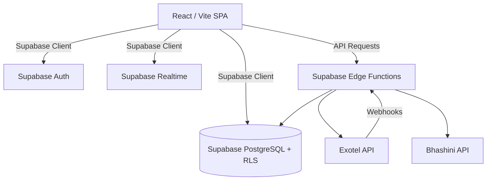

# Backend Technology Architecture & Migration Specification - KrishiDwaar

**Project:** KrishiDwaar (SIH26032) Farmer Procurement Management System

---

## 1. Production Architecture Overview

The system currently operates on a Node.js Express + React 18 SPA architecture with real-time WebSockets and static asset bundling via Vite (`public/assets/` -> `dist/assets/`). This document outlines the technical specification and future migration blueprint to a Serverless BaaS architecture using Supabase.

---

## 2. Target Technology Architecture (Supabase BaaS)

---

## 3. PostgreSQL Database Schema

### Core Tables

1. `profiles`
   - `id` (UUID, PK, references `auth.users.id`)
   - `role` (enum: 'FARMER', 'MANDI_OFFICER', 'ADMIN')
   - `created_at` (timestamp)

2. `farmers`
   - `id` (UUID, PK, references `profiles.id`)
   - `farmer_id` (varchar, unique, 8-digit)
   - `name`, `mobile`, `village`, `district`, `state`

3. `mandis`
   - `id` (varchar, PK, e.g., 'MANDI01')
   - `name`, `location`, `capacity_per_slot`
   - `officer_profile_id` (UUID, references `profiles.id`)

4. `crops`
   - `id` (varchar, PK)
   - `name`, `msp_rate`, `icon`

5. `bookings`
   - `id` (UUID, PK)
   - `farmer_id` (UUID, FK)
   - `mandi_id` (varchar, FK)
   - `crop_id` (varchar, FK)
   - `date` (date)
   - `time_slot` (varchar)
   - `token_number` (varchar, unique per date/mandi)
   - `status` (enum: 'ACTIVE', 'CANCELLED', 'NO_SHOW', 'COMPLETED')
   - `arrival_status` (enum: 'PENDING', 'ARRIVED')
   - `procurement_stage` (enum: 'WAITING', 'IN_PROGRESS', 'COMPLETED')
   - `expected_qty` (numeric)

6. `procurements`
   - `id` (UUID, PK)
   - `booking_id` (UUID, FK, unique)
   - `actual_qty` (numeric)
   - `rate_applied` (numeric)
   - `total_amount` (numeric)
   - `billed_by` (UUID, references `profiles.id`)
   - `created_at` (timestamp)

---

## 4. Static Asset Distribution & Build Target
- Source assets are stored in `public/assets/` (`admin_portal_assets/`, `farmer_portal_assets/`, `mandi_officer_portal_assets/`).
- Build step `npm run build` transfers all assets into `dist/assets/`.
- All component image references use `/assets/...` paths resolving cleanly in both dev (`public/assets`) and production (`dist/assets`).
